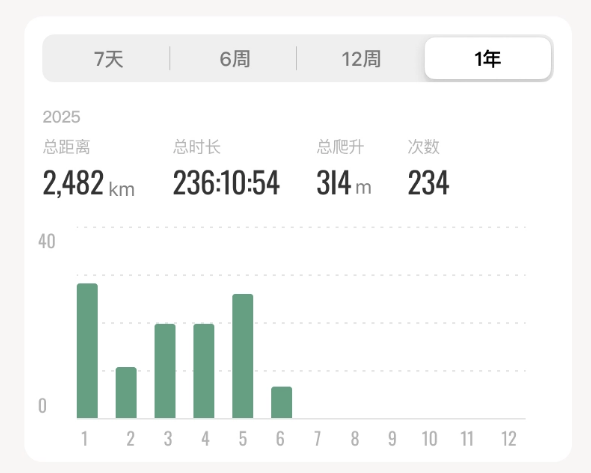
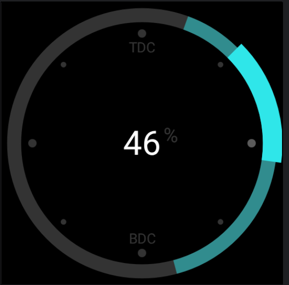
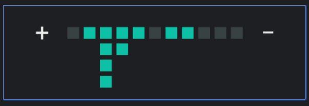

# AndroidViewLab
记录日常/工作中的自定义View

* 骑行数据卡片 - RecordAnalysisCard

  

* 带有进度条的Button - ProgressButton
  
  
* 可以展开/折叠的TextView - ExpandableTextView
  

* 功率分布环形图 - PowerDistributionChart

  

* 踩踏中心偏移点状分布图 - PedalCenterOffsetView

  
